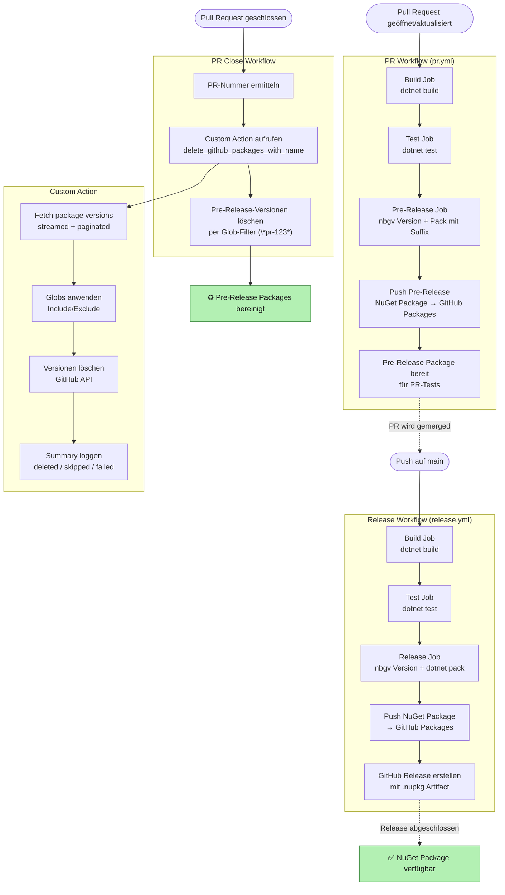

# Very useful reasons

Uses the
endpoint https://bofh-api.bombeck.io/v1/excuses/all.

Credits go to https://bombeck.io/projects/bastard-operator-from-hell-generator 

## Usage

Library built upon .NET 8

```csharp
using Very_Useful_Reasons;

string reason = await UsefulReasons.GetReason();
```

## GitHub Actions Übersicht


